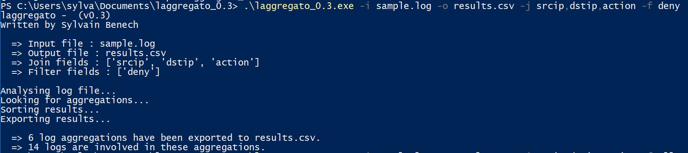

# Laggregato

Laggregato stands for "Log Aggregator"
Parse a given log file and aggregate lines based on given fields for jointure. 
The utput format is a CSV file with ; delimiter. 

i.e. Can be used for firewall log traffic analysis (initial purpose of this tool).

Log fields format must be key=value or key="va lue"

 

## Prerequisites

* An input log file formatted with key=value or key="va lue"
* A working python environment or a Windows OS using the Windows binary file [laggregato_0.3.zip](bin/windows/laggregato_0.3.zip).  

## Basic usage

```laggregato.exe -h```

```laggregato.exe --help```

```laggregato.exe -i <input_log_file> -o <output_csv_file> -j <jointures list> [-f <filters>]``` 

### Mandatory arguments

```-i, --ifile```

Path of the input log file. The input log file must be readable and in text format.

<br/>```-o, --ofile```

Path of the output csv file. The output csv file folder must be writable.


<br/>```-j```

List of fields for jointure in one of the following format :

```srcip```

```srcip,dstip,action```

```"srcip","dstip","action"```

If the quotes really exist in the log file, they must be escaped with \ as shown below :

```\"Field name here\"```

### Optional arguments

```-f```

Optional list of patterns. Only logs mathing these patterns will be processed. 

## Todo list

* Improve readme file 
* Specify the input log format. For now, only logs formatted with key=value or key="va lue" are working.
* Create an exclusion list for filtering patterns

## Authors

* **Sylvain Benech** - *Initial work* - [Chuck182](https://github.com/Chuck182)

## License

This project is licensed under the GPL v3 License - see the [LICENSE.md](LICENSE.md) file for details

## Contribution

Feel free to contribute to this project. 
